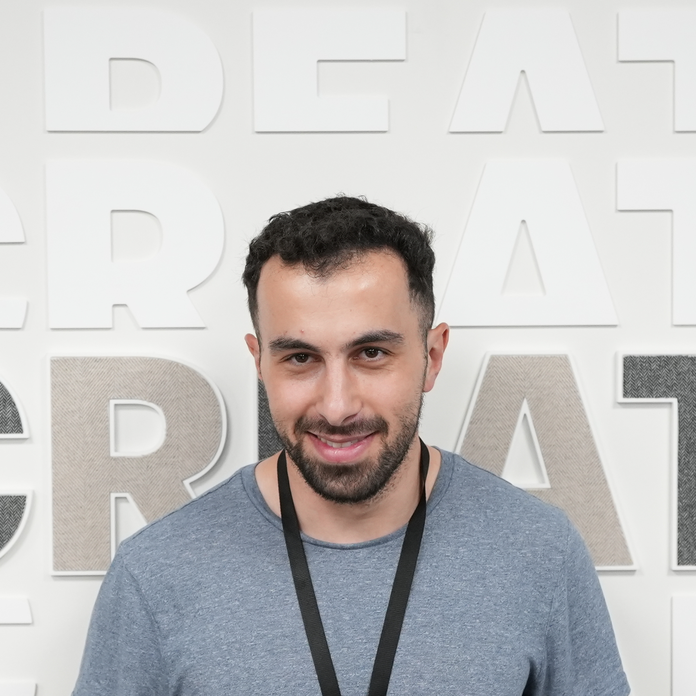

<h1 align="center">Hi 👋, I'm Akiva</h1>

  

<h3 align="left">Hi there, I'm a Junior Software Engineer based in Leeds. I'm skilled in both Frontend and Backend frameworks, with a passion for problem solving and continuous learning.</h3>
&emsp;

---

&emsp;

 <ul>
            <li>🎯 <b>I’m currently focusing on</b>: <a href="https://play.google.com/store/apps/details?id=com.job_application_tracker">Job Tracker</a>, an Android app to track job application details.</li>
            <li>🤔 <b>I’m currently open for</b>: A new job opportunity, <a href="https://akivakaufman.co.uk/">download my CV on my website</a>.</li>
            <li>📫 <b>How to reach me</b>: Connect with me on <a href="https://www.linkedin.com/in/akivakaufman/">LinkedIn</a> or contact me through my <a href="https://akivakaufman.co.uk/">portfolio website</a>.</li>
            <li>😄 <b>Fun facts</b>: I'm a biker'(🏍️), I'm learning Spanish(🇪🇸) and I love traveling(🌍).</li>
        </ul>
&emsp;

## 🛠️ My Skills

### Programming languages:

&emsp;

### Backend:

&emsp;

### Hosting:

&emsp;

### Libraries and Frameworks:

&emsp;

### Misc tools:

&emsp;

&emsp;

## 📈 My GitHub Stats and Activity

### 💻 Profile Stats

### 🔥 Streak Stats

### 📊 Contribution Stats

