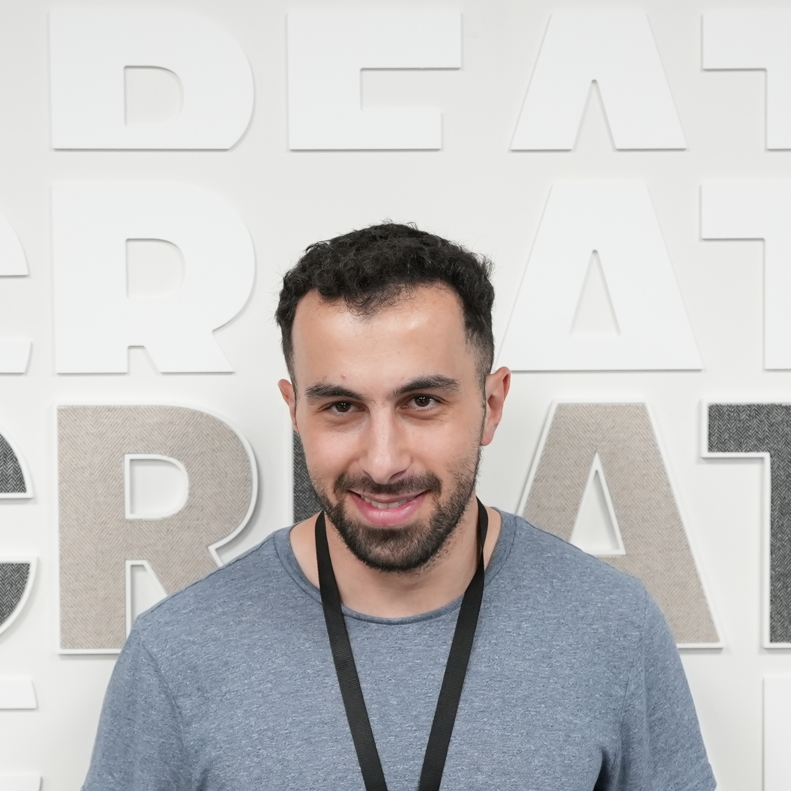

<h1 align="center">Hi 👋, I'm Akiva</h1>

  

<h3 align="left">Software Engineer at BearTech, based in Leeds. I build fullstack web and mobile products with TypeScript, React, Go and Python.</h3>
&emsp;

---

&emsp;

- 📫 **How to reach me**: connect on [LinkedIn](https://www.linkedin.com/in/akivakaufman/) or through my [portfolio website](https://akivakaufman.co.uk/)
- 🌍 **Outside work**: I'm learning Spanish and enjoy travelling.

&emsp;

## 🛠️ My Skills

### Languages:

&emsp;

### Backend:

&emsp;

### Libraries and Frameworks:

&emsp;

### Tools & Cloud:

&emsp;

&emsp;

## 📈 My GitHub Stats and Activity

### 💻 Profile Stats

### 🔥 Streak Stats

### 📊 Contribution Stats

